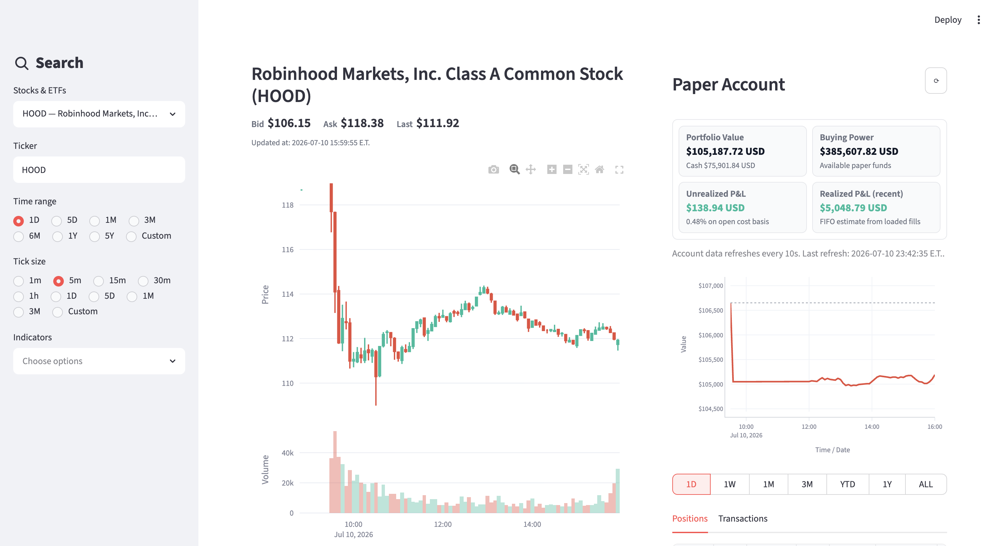
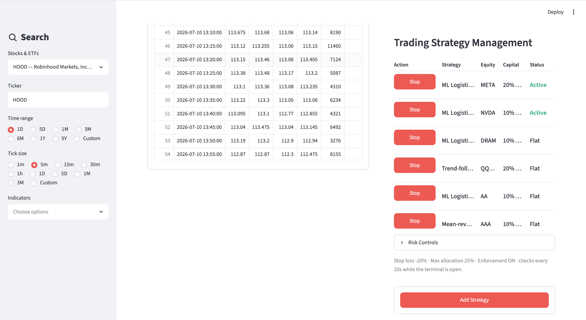
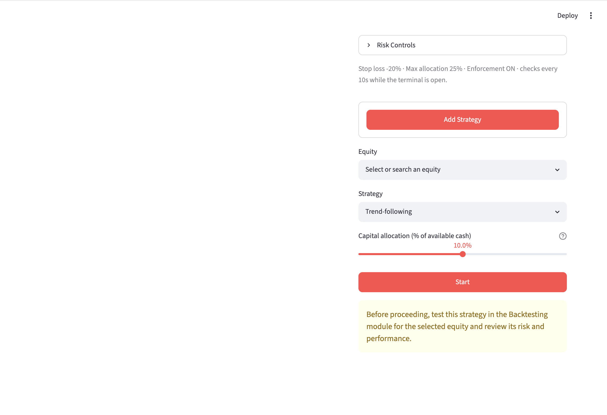
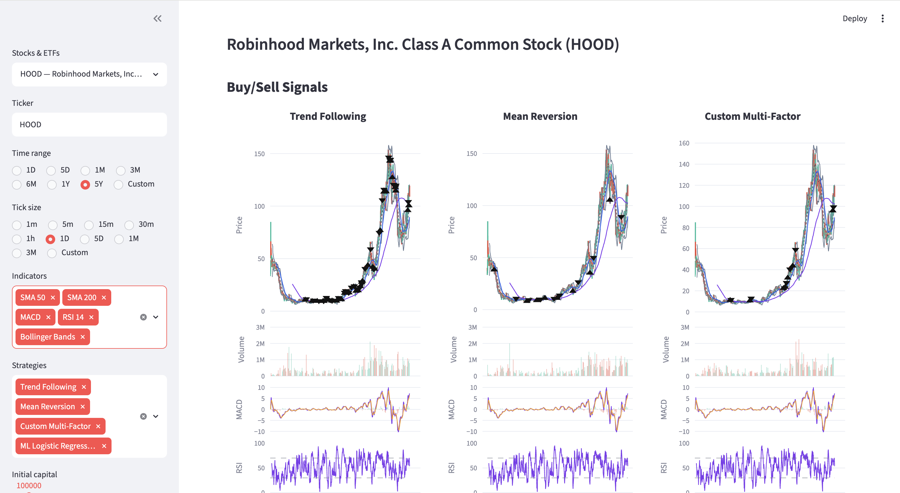
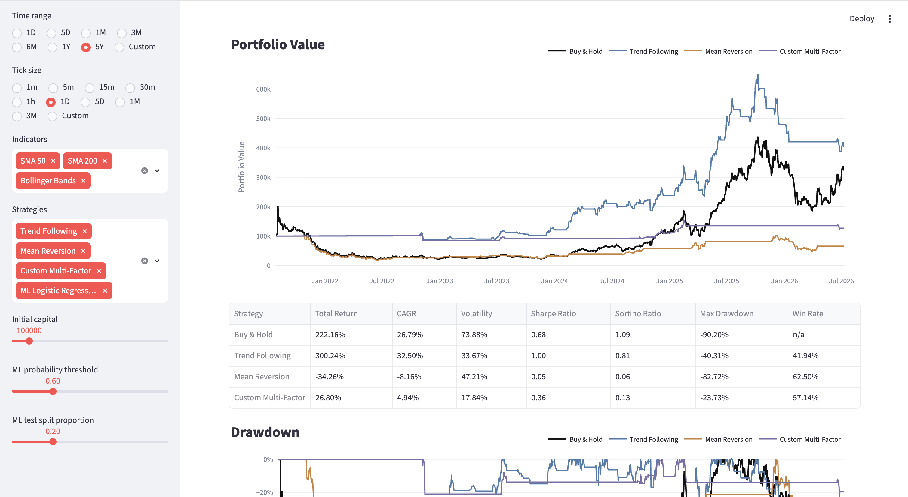
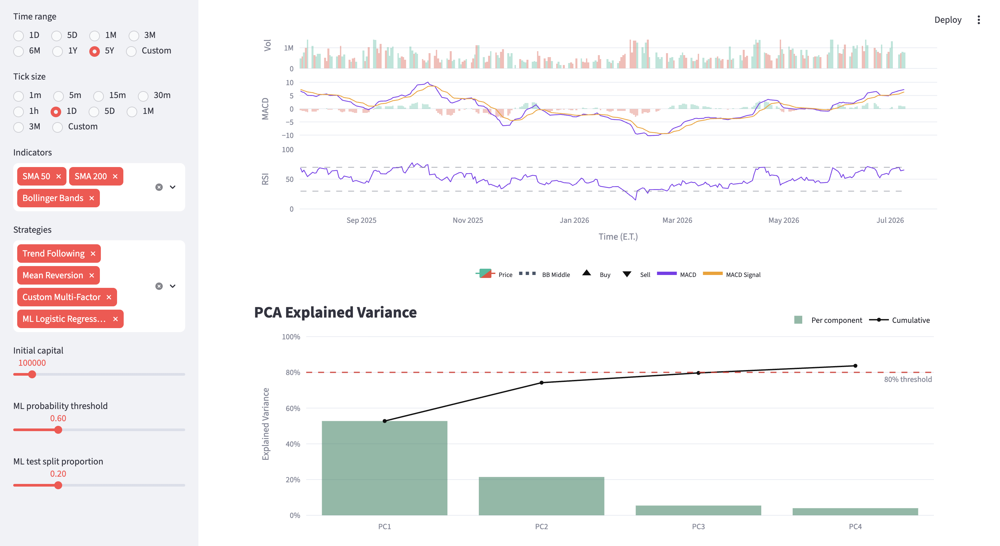
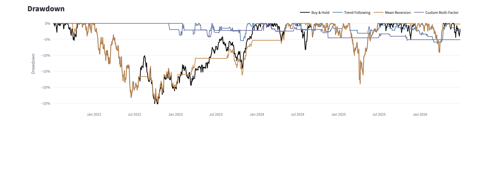

# Alpaca Market Data and Algorithmic Trading Terminal

Streamlit terminal for Alpaca market data display, strategy backtesting, trading signal generation, and Alpaca paper-trading execution.

## Executive Summary

This project connects to Alpaca APIs to retrieve historical OHLCV data, display
interactive price and volume charts, stream live bid/ask/last-trade updates,
backtest trading strategies, and manage rule-based and ML strategies in Alpaca paper trading.

The system features two Streamlit modes/terminals:

- `trading.py`: market data terminal with historical charts, live quotes, paper account monitoring, strategy management, and risk controls.
- `backtesting.py`: strategy backtesting terminal for rule-based strategies and ML logistic-regression holdout backtesting, benchmarked to buy-and-hold.

This is paper trading only - no real money is used.


## Demo Video

- Market data terminal: https://youtu.be/Zx6PTew7rmc
- Strategy backtester: https://youtu.be/NmMOAOslkIA
- ML signal, backtest, and paper trading: https://youtu.be/1IEC2_sxidU
- Final Presentation: https://youtu.be/xkLkusaqrt0

## Screenshots

### Trading Terminal







### Backtesting Terminal









## Setup

Create and activate the conda environment:

```bash
conda env create -f environment.yml
conda activate alpaca-terminal
```

Create local config files from the examples:

```bash
cp .env.example .env
cp risk_config.example.json risk_config.json
cp strategy_config.example.json strategy_config.json
```

Then add your Alpaca paper API key and secret to `.env`:

```text
ALPACA_API_KEY=your_paper_api_key_here
ALPACA_SECRET_KEY=your_paper_secret_key_here
ALPACA_DATA_FEED=iex
```

The local `.env`, `risk_config.json`, and `strategy_config.json` files are
ignored by Git so credentials and personal settings are not committed.

## Run

Run the trading terminal:

```bash
streamlit run trading.py
```

Run the backtesting terminal:

```bash
streamlit run backtesting.py
```

## Documentation

- [`docs/strategy_indicators.md`](docs/strategy_indicators.md): strategy and
  indicator details.
- [`docs/feature_model.md`](docs/feature_model.md):
  feature engineering, PCA, ML signal, backtesting, and paper-trading workflow.


## Repository Structure

```text
alpaca-market-data-terminal/
├── trading.py                  # Market data, paper account, strategies, risk
├── backtesting.py              # Rule-based and ML backtesting
├── docs/
│   ├── feature_model.md
│   └── strategy_indicators.md
├── screenshots/                # Demo screenshots
├── src/
│   ├── __init__.py
│   ├── backtester.py
│   ├── company.py
│   ├── company_search.py
│   ├── config.py
│   ├── data_connector.py
│   ├── execution.py
│   ├── features.py
│   ├── formatting.py
│   ├── historical.py
│   ├── indicators.py
│   ├── live_quotes.py
│   ├── metrics.py
│   ├── models.py
│   ├── plots.py
│   ├── risk.py
│   └── strategies.py
├── .env.example
├── risk_config.example.json
├── strategy_config.example.json
├── .gitignore
├── environment.yml
├── requirements.txt
├── LICENSE
└── README.md
```

## Behavioral Notes

During after-hours periods, live quote updates may be sparse in the market data
terminal, but the panel should still show the last available quote.

Active and flat strategies are restored from the local `strategy_config.json`
file. Risk settings are restored from the local `risk_config.json` file.

The strategy and ML backtesters are exploratory tools. Paper trading is for
testing only, not production portfolio accounting.

## Security Notes

Do not commit `.env`, `risk_config.json`, `strategy_config.json`, or real API
credentials. Commit only the example config files.
