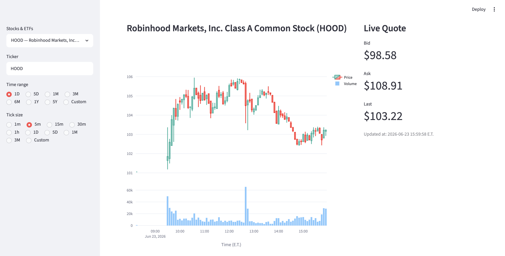
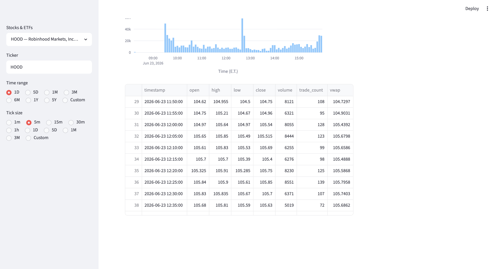

# Alpaca Market Data and Trading Terminal

Streamlit terminal for Alpaca market data display, strategy backtesting, machine
learning signal generation, and Alpaca paper-trading execution.

## Executive Summary

This project connects to Alpaca APIs to retrieve historical OHLCV data, display
interactive price and volume charts, stream live bid/ask/last-trade updates,
backtest long-only trading strategies, and demonstrate a machine-learning
trading signal in Alpaca paper trading.

The system features two Streamlit modes:

- `trading.py`: market data terminal with historical charts, live quotes, an ML trading signal panel with automatic paper-order submission, and paper-trading logs.
- `backtesting.py`: strategy backtesting terminal for rule-based strategies and ML logistic-regression holdout backtesting, benchmarked to buy-and-hold.

This is paper trading only - no real money is used.


## Demo Video

- Market data terminal: https://youtu.be/Zx6PTew7rmc
- Strategy backtester: https://youtu.be/NmMOAOslkIA
- ML signal, backtest, and paper trading: https://youtu.be/1IEC2_sxidU

## Screenshots

### Market Data Terminal





### Backtesting Terminal


### ML Signal and Paper Trading


## Setup

Create and activate the conda environment:

```bash
conda env create -f environment.yml
conda activate alpaca-terminal
```

Create a local `.env` file from the example:

```bash
cp .env.example .env
```

Then add your Alpaca paper API key and secret to `.env`:

```text
ALPACA_API_KEY=your_paper_api_key_here
ALPACA_SECRET_KEY=your_paper_secret_key_here
ALPACA_DATA_FEED=iex
```

## Run

Run the trading terminal:

```bash
streamlit run trading.py
```

Run the backtesting terminal:

```bash
streamlit run backtesting.py
```

## Documentation

- [`docs/strategy_indicators.md`](docs/strategy_indicators.md): strategy and
  indicator details.
- [`docs/feature_model.md`](docs/feature_model.md):
  feature engineering, PCA, ML signal, backtesting, and paper-trading workflow.


## Repository Structure

```text
alpaca-market-data-terminal/
├── trading.py                  # Market data terminal and ML paper-trading panel
├── backtesting.py              # Rule-based and ML backtesting terminal
├── docs/
│   ├── Week2_Report.pdf        # Homework 2 report
│   ├── feature_model.md        # Features, PCA, and ML Model documentation
│   └── strategy_indicators.md  # Strategy and indicator documentation
├── logs/
│   └── paper_trading.log       # Runtime paper-trading execution log
├── screenshots/                # Demo screenshots
├── src/
│   ├── __init__.py
│   ├── backtester.py           # Strategy simulation and buy-and-hold benchmark
│   ├── company.py              # Ticker-to-company-name lookup
│   ├── company_search.py       # Ticker/company search choices
│   ├── config.py               # Alpaca credentials and data-feed settings
│   ├── data_connector.py       # Historical, streaming, and paper-trading clients
│   ├── execution.py            # Latest signal to Alpaca paper-order execution
│   ├── features.py             # ML features, target, scaling, and PCA
│   ├── historical.py           # Historical OHLCV bar retrieval
│   ├── indicators.py           # Technical indicator columns
│   ├── live_quotes.py          # Alpaca websocket quote/trade streaming
│   ├── metrics.py              # Performance metric calculations
│   ├── models.py               # Logistic regression training and ML signals
│   ├── plots.py                # Plotly charts for signals, PCA, and performance
│   └── strategies.py           # Rule-based long-only strategy signals
├── .env.example                # Template for Alpaca paper credentials
├── .gitignore                  # Excludes local secrets, caches, and system files
├── environment.yml             # Conda environment specification
├── requirements.txt            # Python package requirements
├── LICENSE
├── SKILL.md
└── README.md
```

## Behavioral Notes

During after-hours periods, live quote updates may be sparse in the market data
terminal, but the panel should still show the last available quote.

The ML model cache is Streamlit session-local. Restarting Streamlit clears the
cached model, so the model should be trained again before refreshing the latest
signal or submitting a paper order.

The strategy and ML backtesters are intended for exploratory analysis. They are
not production trading or portfolio accounting systems.

## Security Notes

Do not commit `.env` or real API credentials. Commit `.env.example` only.
